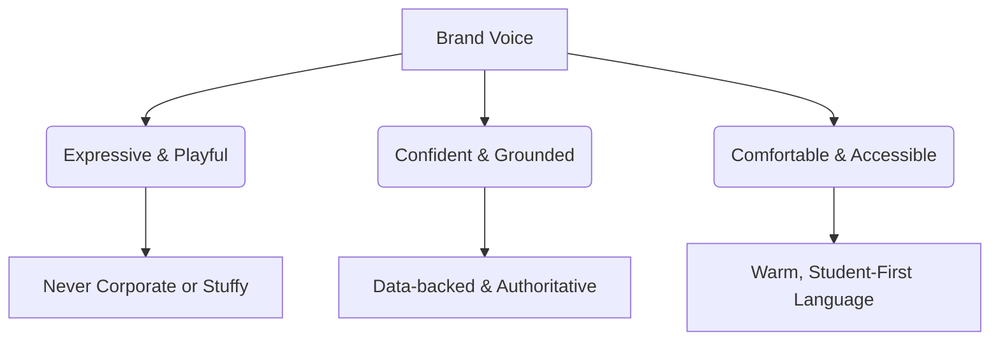

# Collego — Brand Identity & Design System
> **Tagline:** Everything after the exam.
> **Design Paradigm:** Playful Geometry

---

## 1. Brand Philosophy

Collego is built for a generation of students who have spent years in high-pressure testing environments. The moment their exam ends, they are thrown into a chaotic, corporate, and stressful college admissions landscape. 

Collego’s brand mission is to transform this anxiety-inducing period into a **confident, exploratory, and rewarding transition**. 

### Brand Personality Spectrum


*   **Friendly & Confident:** We speak to students as peers, not as guidance counselors or institutional bureaucrats.
*   **Comfortable & Fast:** The platform feels light, snappy, and clear.
*   **Empathetic but Bold:** Acknowledging the stress of admissions while projecting optimism and clarity.

---

## 2. Design Philosophy: Playful Geometry

"Playful Geometry" is a design system sitting at the intersection of **Apple's premium hardware styling**, **Figma's fluid canvas dynamics**, and **a modern interactive science museum**.

```
    [ Apple ]           [ Figma ]           [ Science Museum ]
 (Premium & Clean)    (Fluid & Canvas)       (Tactile & Playful)
         \                   |                   /
          \                  |                  /
           +-----------------+-----------------+
                             |
                   [ PLAYFUL GEOMETRY ]
```

### Core Tenants of Playful Geometry
1.  **Purposeful Shapes:** Circles represent community and continuity; rounded rectangles are containers of structured information; capsules function as high-action triggers or status badges.
2.  **Floating Dimension:** Cards do not lay flat on the grid. They hover, drop soft shadows, and slide with physics-based spring curves.
3.  **Deliberate Asymmetry:** Breaking standard SaaS grid lines. Allowing cards to slightly overlap or stack at minor angles to invite interaction and make the canvas feel alive.

---

## 3. Brand Moodboard

Below is the established logo direction, color harmonies, and visual moodboard designed for Collego. It outlines the core visual structure, combining clean typography with overlapping geometric shapes.


### Logo Direction
The logo mark consists of a stylized geometric **"C"** constructed out of overlapping colorful rings, encompassing a floating **graduation cap**. 
*   **Geometric Construction:** Perfect arcs and circles assembled to form a cohesive, recognizable symbol.
*   **Symbolic Meaning:** The outer rings represent the chaotic admissions landscape coming together to guide the student towards their academic capstone (the graduation cap).

---

## 4. Color System

We reject generic SaaS blues in favor of a vibrant, high-contrast, yet comfortable palette. Each core feature of the platform has an assigned **"Anchor Accent"** that signals context instantly.

| Color Name | Hex Code | Canvas Role | Feature Mapping | Accessibility (vs Light Background) |
| :--- | :--- | :--- | :--- | :--- |
| **Parchment White** | `#FBFBF9` | Core Background | Global Canvas | AA |
| **Ink Charcoal** | `#1C252C` | Core Text | Typography & Borders | AAA |
| **Volt Lime** | `#AEEA00` | Accent | Predictor / Success | AA (with dark text overlay) |
| **Solar Orange** | `#FF9800` | Accent | Discussion Forums | AA |
| **Electric Purple** | `#9575CD` | Accent | AI Counsellor & Planning | AA |
| **Sky Blue** | `#4FC3F7` | Accent | Resources & Cutoffs | AA |
| **Soft Sage** | `#E8F5E9` | Alert Green | Safe / High Probability | AA |
| **Muted Clay** | `#FFEBEE` | Alert Red | Risky / Low Probability | AA |

---

## 5. Typography System

The typography relies on an editorial pairing of a bold geometric display face with an extremely readable, modern sans-serif.

*   **Display Header Font: Clash Display** (by Custom Type Foundry / Google Fonts alternative: **Cabinet Grotesk**)
    *   *Why:* Beautifully geometric, sharp terminals, editorial posture. It brings immediate confidence and authority to headlines.
*   **Body & Utility Font: Satoshi** (by Custom Type Foundry / Google Fonts alternative: **General Sans** or **Geist**)
    *   *Why:* Extremely legible at small sizes, excellent x-height, and features geometric circular curves that echo the brand's shapes.

```
Clash Display Bold (48px)   ->   "Everything after the exam."
Satoshi Regular (16px)      ->   "Enter your rank, explore campus cutoffs, and map out your counseling path."
```

### Scale & Hierarchy
```css
--font-size-h1: 3.5rem;    /* 56px */
--font-size-h2: 2.5rem;    /* 40px */
--font-size-h3: 1.75rem;   /* 28px */
--font-size-body: 1rem;    /* 16px */
--font-size-small: 0.85rem;/* 13.6px */
```

---

## 6. Grid & Layout System

Collego does not use a rigid, repeating box grid. Instead, it utilizes an **Asymmetric Canvas Grid**.

```
[ Canvas: 12-Column Responsive Layout ]
| [Col 1-4] | [Col 5-8] | [Col 9-12] |
|   Card 1  |   Card 2  |            |  <-- Standard Row
|        [ Card 3 (Overlaps Card 2 & 4) ] <-- Playful Geometry break
```

### Layout Rules
1.  **The Canvas Canvas:** Core grid is a standard 12-column setup, but individual elements are allowed to **break out** or **offset** by standard increments (e.g., `-16px` translation along the X or Y axis).
2.  **Offset Cards:** Featured content cards (like AI counselor recommendations) should use a subtle rotation (`transform: rotate(-0.5deg)`) on hover to feel like physical paper on a desk.
3.  **Variable Card Heights:** Column layouts do not force uniform card heights, allowing forums and review components to flow naturally like a Pinterest-meets-editorial layout.

---

## 7. Spacing System

All padding, margins, and gaps are calculated using a geometric base-4 scale.

```
4px   ->   8px   ->   12px   ->   16px   ->   24px   ->   32px   ->   48px   ->   64px   ->   96px
```
*   **4px / 8px:** Micro spacing (inside badges, buttons, form inputs).
*   **12px / 16px:** Component interior padding (between text and borders inside cards).
*   **24px / 32px:** Card grid spacing and layout padding.
*   **48px / 64px / 96px:** Large sections, heroes, and header margins.

---

## 8. Iconography

Iconography must reflect the physical nature of "Playful Geometry".
*   **Style:** Thick stroke weight (2px), open loops, and high border-radius corners.
*   **Container Shape:** Icons are always housed in a soft, colored background shape (usually a rounded squircle, circle, or capsule).
*   **Interactive Behavior:** On hover, the icon internally shifts or rotates (e.g., a gear rotates 45 degrees, a bell shakes slightly).

---

## 9. Illustration Style

```
  +---------+      /\      +---+
  | Rounded |     /  \     | O |
  | Rect    |    /____\    +---+
  +---------+   (Triangle) (Circle)
```
*   **Abstract Over Character:** Never use standard vector flat illustrations of "happy working people". Instead, construct conceptual illustrations from pure geometric building blocks: 3D spheres, transparent glass prisms, cones, and rounded blocks.
*   **Depth:** Use subtle gradients, blending modes (e.g., screen or color burn), and soft drop shadows to create a tactile, physical layering effect.

---

## 10. Component Library

### 10.1 Buttons
Buttons must look tactile.
*   **Primary Button:** Rounded capsule shape, solid color accent, thick border (2px) in Ink Charcoal, and a solid shadow offset. On click, the button translates down-right to hide the shadow, mimicking a physical click.
*   **Secondary Button:** White background, thin border, light shadow.

```css
.btn-primary {
  background-color: var(--color-lime);
  border: 2px solid var(--color-ink);
  box-shadow: 4px 4px 0px var(--color-ink);
  transition: all 0.1s cubic-bezier(0.175, 0.885, 0.32, 1.275);
}
.btn-primary:active {
  transform: translate(3px, 3px);
  box-shadow: 1px 1px 0px var(--color-ink);
}
```

### 10.2 Cards
Cards are the primary building blocks.
*   **Default Card:** Rounded corners (`border-radius: 20px`), thin border (`1px solid #1C252C` with 10% opacity), soft blur drop shadow.
*   **Active Hover Card:** On mouse hover, the card lifts (`transform: translateY(-6px)`), and its shadow deepens and diffuses.

### 10.3 Spotlight Search
A clean, floating navigation bar mimicking desktop application launchers.
*   **Trigger:** Command/Ctrl + K.
*   **Visuals:** Centered modal, glassmorphism backdrop filter, zero borders, large typography.

### 10.4 Comparison Tables
*   Instead of standard dry rows and columns, comparison tables feature "sticky cards" that stack on top of each other as you scroll, allowing side-by-side college reviews to feel interactive.

---

## 11. Motion Guidelines

Animations must feel bound by gravity and momentum.

### Spring Physics Specifications
*   **Card Lifts / Page Transitions:** Use a soft-spring transition.
    *   *CSS:* `transition: transform 0.4s cubic-bezier(0.34, 1.56, 0.64, 1);`
*   **Buttons / Micro-interactions:** Snappy, instantaneous spring.
    *   *CSS:* `transition: transform 0.15s cubic-bezier(0.25, 1, 0.5, 1);`

---

## 12. Landing Page Design

The landing page functions as an interactive canvas. Rather than presenting generic sales pitches, it shows the platform’s product modules as interactive toys.


### Landing Page Key Sections
1.  **Navigation:** Minimalist header, logo on the left, primary tabs (Predictor, Planning, Forums) in the center, and a capsule "Get Started" button on the right.
2.  **Hero:** Large display headline: `Find your future. Everything after the exam.`
3.  **Spotlight Search:** Placed directly in the center of the hero. Typing immediately initiates real-time searches for colleges, branches, counseling dates, and exam cutoffs.
4.  **Floating Module Cards:** Three prominent interactive cards featuring **College Predictor** (Volt Lime), **Counselling Planner** (Electric Purple), and **Discussion Forums** (Solar Orange).

---

## 13. Dashboard Design

The dashboard increases information density while keeping visual noise low.

```
+-------------------------------------------------------+
|  [Logo] Collego       [Search Bar]       (Notifications) [Avatar] |
+-------------------------------------------------------+
|  Welcome back, Rohan!                                 |
|                                                       |
|  [ Your Predictor Summary ]   [ Next Counseling Milestone ] |
|  - IIT Bombay CSE (94%)       - Choice Filling Starts |
|  - BITS Pilani EEE (78%)        In 2 Days             |
|                                                       |
|  [ Forum Feed (Trending)  ]   [ Top Resources for JEE ] |
+-------------------------------------------------------+
```

*   **Usability First:** Layout is structured, but cards retain the 20px rounded corners and color-mapped indicators.
*   **Alert Corner:** A specialized sidebar that updates in real-time with official counseling announcements, ensuring students never miss critical deadlines.

---

## 14. Predictor Design (Flagship Feature)

The Predictor translates dry historical cutoff trends into an exciting, easy-to-read admissions radar.


### Card Anatomy
*   **Title Block:** Clean contrast displaying college name, location, and branch name.
*   **Probability Badge:** Volt Lime pills for **High Chance** (e.g., >85%), Muted Sage for **Good Chance**, and Soft Clay/Red for **Risky** matches.
*   **Cutoff Difference Meter:** A clear horizontal bar chart comparing the student's rank directly with last year's cutoff bounds, immediately showing where their score falls.
*   **AI Insight & Reasoning:** A concise block explaining *why* the prediction was generated (e.g., "History confirms a strong standing for your JEE Advanced score in CSE").

---

## 15. Forums Design

We move away from standard message-board lists. Forums are styled as **"Conversation Streams"**.
*   **Card-based feeds:** Posts are displayed inside dynamic grids.
*   **Color coding:** Discussion topics are tagged with solid-color capsules (e.g., `#JEE`, `#Counselling`, `#BITS`).
*   **Visual scans:** Profile pictures are housed in circular capsules, and interactive upvotes look like physical counters that increment with a minor spring bounce.

---

## 16. Mobile Design

On mobile, the horizontal layouts transition seamlessly into an editorial feed.

```
+-----------------------+
| Collego           (o) |
+-----------------------+
|  [ Spotlight Search ] |
|                       |
|  +-----------------+  |
|  | Predictor (Lime)|  |
|  +-----------------+  |
|  | Planner (Purple)|  |
|  +-----------------+  |
|  | Forums (Orange) |  |
|  +-----------------+  |
+-----------------------+
```

*   **Native Gestures:** Cards can be swiped horizontally to swap between college branches or counselling timelines.
*   **Sticky Bottom Bar:** A floating capsule bottom-navigation bar holds primary shortcuts (Search, Predictor, Forums, Planner) with quick thumb access.

---

## 17. Dark Mode Strategy

We avoid absolute pure black (`#000000`) to maintain the friendly, premium nature of the brand.
*   **Background Canvas:** Deep charcoal blue (`#0D131A`).
*   **Card Faces:** Sleek glassmorphism tiles (`rgba(25, 35, 47, 0.8)` with backdrop blur).
*   **Accents:** Bright saturated colors (Volt Lime becomes glowing neon green, Solar Orange shifts to bright amber) that pop cleanly against dark backdrops.

---

## 18. Accessibility Guidelines (A11y)

*   **Color Contrast:** All accent colors on canvas buttons must satisfy the **WCAG 2.1 AA** requirements. Text overlays use dark Ink Charcoal rather than white when overlaying brighter colors like Volt Lime or Solar Orange.
*   **Focus Ring:** Customized, high-contrast, double-layered outline rings (`border: 2px solid #1C252C` + `outline: 2px solid var(--accent)`) that follow the geometric shape of the focused card or input.

---

## 19. Design Tokens (JSON Schema)

```json
{
  "global": {
    "color": {
      "bg": { "value": "#FBFBF9" },
      "text": { "value": "#1C252C" },
      "primary": { "value": "#AEEA00" },
      "secondary": { "value": "#9575CD" },
      "accent": { "value": "#FF9800" },
      "blue": { "value": "#4FC3F7" }
    },
    "spacing": {
      "xs": { "value": "4px" },
      "sm": { "value": "8px" },
      "md": { "value": "16px" },
      "lg": { "value": "24px" },
      "xl": { "value": "32px" }
    },
    "fontFamily": {
      "display": { "value": "Clash Display, Cabinet Grotesk, sans-serif" },
      "body": { "value": "Satoshi, General Sans, sans-serif" }
    },
    "shadows": {
      "soft": { "value": "0 10px 30px rgba(28, 37, 44, 0.05)" },
      "lifted": { "value": "0 20px 40px rgba(28, 37, 44, 0.12)" },
      "tactile": { "value": "4px 4px 0px #1C252C" }
    },
    "motion": {
      "springSoft": { "value": "all 0.4s cubic-bezier(0.34, 1.56, 0.64, 1)" },
      "springSnappy": { "value": "all 0.15s cubic-bezier(0.25, 1, 0.5, 1)" }
    }
  }
}
```

---

## 20. Future Evolution

As Collego expands beyond engineering admissions, the design system will evolve in two directions:
1.  **Context-adaptive themes:** The base theme will shift based on target exams (e.g., Navy & Teal accents for medical exams, Crimson & Sand accents for law and business school portals), while maintaining the signature geometric card architecture.
2.  **Conversational Spaces:** Dynamic cards that peel away to reveal live chat windows with AI counselors, transforming simple data grids into rich, communicative layouts.
